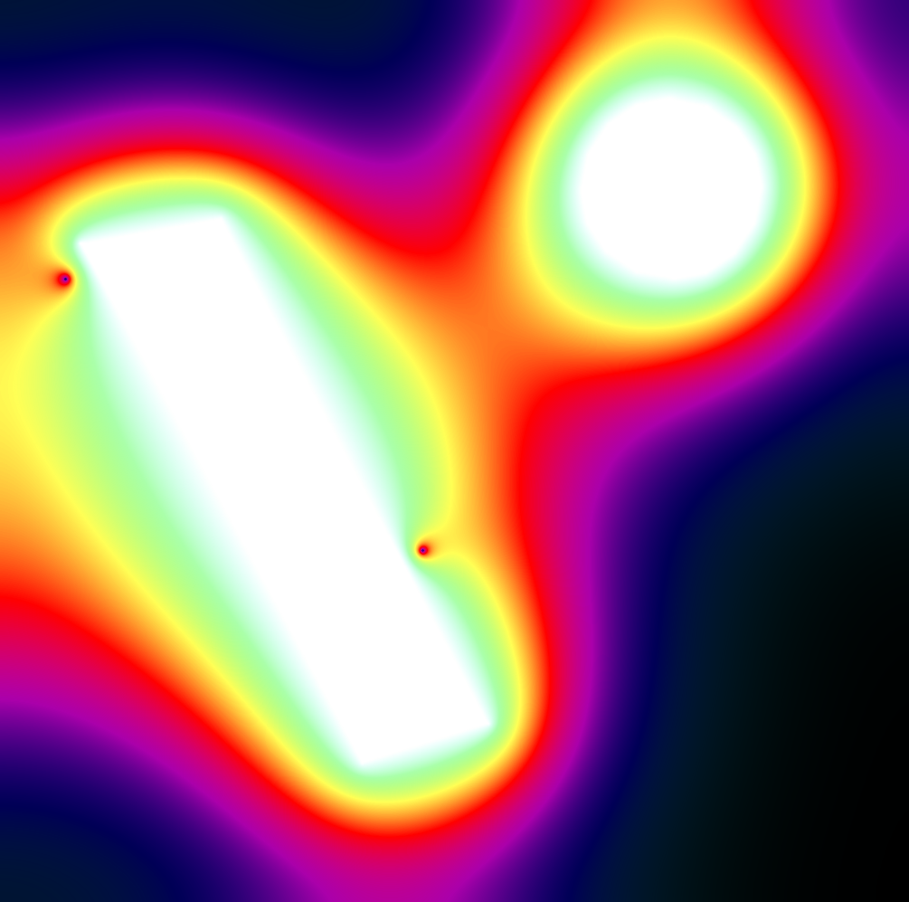
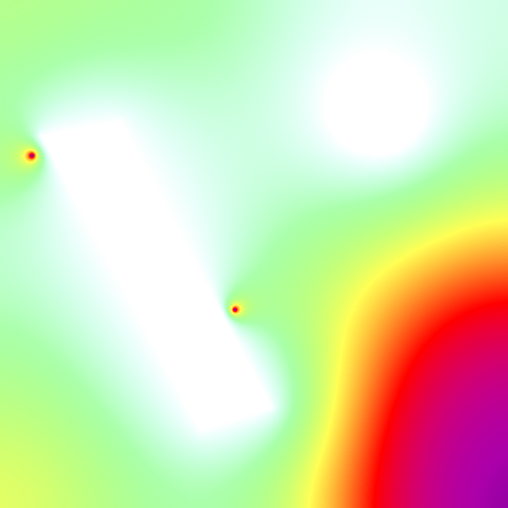

# Assignment 6

Modifying cuda learn by example [chapter 07](http://www.mat.unimi.it/users/sansotte/cuda/CUDA_by_Example.pdf#%5B%7B%22num%22%3A320%2C%22gen%22%3A0%7D%2C%7B%22name%22%3A%22XYZ%22%7D%2C28%2C688%2C1%5D) to change the shape of the heater objects.

## Assignment

Modify the CUDA code in Chapter 7 so  that you replace the square region of heaters with some other plane figure of your (aesthetic) choice. It is optional to use the advanced code which uses Texture Memory. Extra credit for implementation of ghost point optimization.

## Setup

Need to download common folder and put it one directory above this current direcotry from Cuda Learn by Example.

This also requires having nvcc setup along with OpenGL Libraries downloaded.

Compile the program using `make` command.

Run the resultant program can be run with `./heat_2d`.

## Results

The initial render with the program starts looks like this.

After running the program for a bit, the heat spreads out.

Here is the program has the heat has spread out quite a bit.

